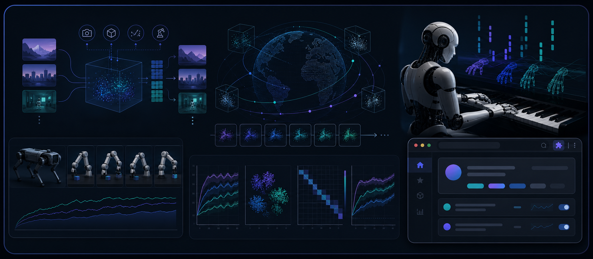

<h1 align="center">En Yi Hou</h1>

  <strong>McGill CS graduate · incoming graduate student at Tsinghua University</strong> 
  Thinking about world models, model-based RL, and predictive representations. 
  Occasionally building browser thingies that got a little too real.

  
  
  
  

  <code>world models</code>
  <code>model-based RL</code>
  <code>predictive representations</code>
  <code>robot learning</code>

  

I like agents that learn internal models of the world, reason with them, and know when action is worth its cost.
Most of my work sits around model-based AI, embodied decision-making, and research code that other people can actually run.

## Currently

- thinking about world models, predictive representations, and model-based RL
- making research repos less cursed to run
- building small tools when a workflow annoys me enough

## Work

The full project gallery lives on my portfolio — papers, figures, case studies, shipped tools, and the occasional thing that started as "just a small script."

  

  <strong><a href="https://portfolio.enyihou.me/#work">Check out my work →</a></strong>

## Stack

  <strong>Research</strong> 
  
  
  
  

  <strong>Building</strong> 
  
  
  
  

