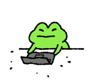

  

<h1 align="center">Hi there, I'm En Yi Hou ~</h1>

  <strong>McGill CS graduate · incoming graduate student in Advanced Computing at Tsinghua University</strong> 
  Thinking about world models, model-based RL, and predictive representations. 
  Occasionally building a little bit of everything (game dev, web dev, plugins, and other useful little tools)

  
  
  

  
  
  
  

 
 
 

<h2 align="center">Daily life of me ~</h2>

  
  &nbsp;⟶&nbsp;
  
  &nbsp;⟶&nbsp;
  
  &nbsp;⟶&nbsp;
  

  
    me write code &nbsp;&nbsp;→&nbsp;&nbsp;
    me debug irl &nbsp;&nbsp;→&nbsp;&nbsp;
    me run code &nbsp;&nbsp;→&nbsp;&nbsp;
    me pray it works
  

 
 
 
 

  I love meeting new friends! Come say hi:
  <a href="mailto:enyi.hou@gmail.com">email</a> ·
  <a href="https://www.instagram.com/who._.ne/">instagram</a>
  

