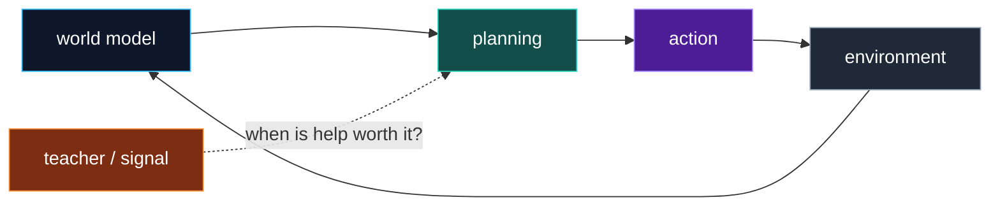

<h1 align="center">En Yi Hou</h1>

  <strong>McGill CS graduate · upcoming Tsinghua graduate student</strong> 
  Thinking about ML stuffs: world models, RL, etc.
  But occasionally making browsers thinggies :3

  <a href="https://portfolio.enyihou.me">Portfolio</a>
  ·
  <a href="https://portfolio.enyihou.me/cv/en-yi-hou-cv.pdf">CV</a>
  ·
  <a href="https://www.linkedin.com/in/enyi-hou/">LinkedIn</a>
  ·
  <a href="mailto:enyi.hou@gmail.com">Email</a>

  <code>world models</code>
  <code>model-based RL</code>
  <code>Representation</code>

---

I like agents that learn an internal model of the world, reason with it, and know when an action is worth its cost. Most of my work lives around model-based AI, embodied decision-making, and research code that other people can actually run.

## Selected Work

<table>
  <tr>
    <td width="52%">
      
    </td>
    <td width="48%">
      <h3>
        <a href="https://github.com/EnYiHou/robopianist-cost-aware-intervention">Cost-Aware Teacher-Side Intervention in RoboPianist</a>
      </h3>
      
Research artifact · Python · PyTorch · JAX/Flax · MuJoCo · RoboPianist

      
A reproducible pipeline for asking a practical question: when is teacher intervention actually worth paying for?

      <ul>
        <li>Built a 14,464-row Human-Like Proxy Error benchmark from curated RoboPianist checkpoints.</li>
        <li>Compared learned intervention models against budgeted and cost-aware baselines.</li>
        <li>Packaged paper, figures, scripts, and an end-to-end run path.</li>
      </ul>
      

        <a href="https://github.com/EnYiHou/robopianist-cost-aware-intervention/blob/main/report.pdf">Paper</a>
        ·
        <a href="https://github.com/EnYiHou/robopianist-cost-aware-intervention">Code</a>
        ·
        <a href="https://github.com/EnYiHou/robopianist-cost-aware-intervention/tree/main/figures">Figures</a>
      

    </td>
  </tr>
</table>

<table>
  <tr>
    <td width="48%">
      <h3>
        <a href="https://github.com/EnYiHou/mclecture">McLecture</a>
      </h3>
      
Shipped tool · TypeScript · React · Vite · Chrome MV3 · FFmpeg/WASM

      
A Chrome extension that helps McGill students save myCourses lecture recordings locally as MP4 files.

      <ul>
        <li>Built recording discovery, quality selection, multi-download queues, and browser-local state.</li>
        <li>Uses bundled FFmpeg assets for local remuxing; no remote analytics or course-data services.</li>
        <li>Maintained with TypeScript, Vitest, Vite, and Playwright screenshot automation.</li>
      </ul>
      

        <a href="https://chromewebstore.google.com/detail/mclecture/ipnhkfogmlokecmpgjhdkkibomgbjmlb">Chrome Web Store</a>
        ·
        <a href="https://github.com/EnYiHou/mclecture">Code</a>
      

    </td>
    <td width="52%">
      
      
    </td>
  </tr>
</table>

## Working Stack

| Research | Engineering | Current interests |
| --- | --- | --- |
| Python · PyTorch · JAX/Flax · MuJoCo · RoboPianist | TypeScript · React · Vite · Chrome Extensions · Vitest · Playwright | model-based AI · planning · embodied agents · applied NLP · open-source research tooling |

## Open Source Direction

Small, runnable things with clear entrypoints. Research repos with enough structure to survive outside my laptop. Tools that remove one annoying step from a real workflow.

## Elsewhere

For papers, figures, case studies, CV, and the fuller portfolio: **[portfolio.enyihou.me](https://portfolio.enyihou.me)**.
